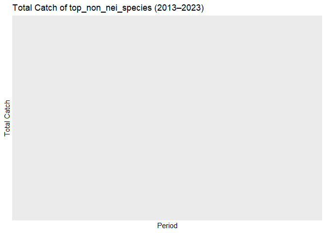
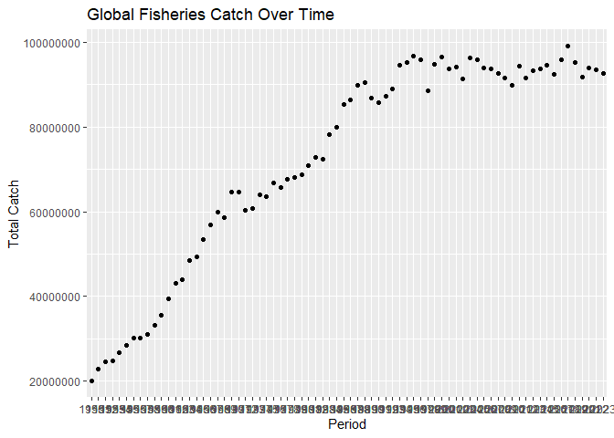

## Instructions
Answer the following questions and/or complete the exercises in RMarkdown. Please embed all of your code and push the final work to your repository. Your report should be organized, clean, and run free from errors. Remember, you must remove the `#` for any included code chunks to run.  

## Load the libraries

``` r
library("tidyverse")
library("janitor")
library("naniar")
options(scipen = 999)
```

## About the Data
For this assignment we are going to work with a data set from the [United Nations Food and Agriculture Organization](https://www.fao.org/fishery/en/collection/capture) on world fisheries. These data were downloaded and cleaned using the `fisheries_clean.Rmd` script.  

Load the data `fisheries_clean.csv` as a new object titled `fisheries_clean`.

``` r
fisheries_clean <- read_csv("data/fisheries_clean.csv")
```

1. Explore the data. What are the names of the variables, what are the dimensions, are there any NA's, what are the classes of the variables, etc.? You may use the functions that you prefer.


``` r
summary(fisheries_clean)
```

```
##      period      continent          geo_region          country         
##  Min.   :1950   Length:1055015     Length:1055015     Length:1055015    
##  1st Qu.:1980   Class :character   Class :character   Class :character  
##  Median :1996   Mode  :character   Mode  :character   Mode  :character  
##  Mean   :1994                                                           
##  3rd Qu.:2010                                                           
##  Max.   :2023                                                           
##  scientific_name    common_name        taxonomic_code         catch           
##  Length:1055015     Length:1055015     Length:1055015     Min.   :       0.0  
##  Class :character   Class :character   Class :character   1st Qu.:       0.0  
##  Mode  :character   Mode  :character   Mode  :character   Median :       2.9  
##                                                           Mean   :    5089.9  
##                                                           3rd Qu.:     400.0  
##                                                           Max.   :12277000.0  
##     status         
##  Length:1055015    
##  Class :character  
##  Mode  :character  
##                    
##                    
## 
```

2. Convert the following variables to factors: `period`, `continent`, `geo_region`, `country`, `scientific_name`, `common_name`, `taxonomic_code`, and `status`.

``` r
names(fisheries_clean)
```

```
## [1] "period"          "continent"       "geo_region"      "country"        
## [5] "scientific_name" "common_name"     "taxonomic_code"  "catch"          
## [9] "status"
```


``` r
fisheries_clean <- fisheries_clean %>%
  mutate(
    period = as.factor(period),
    continent = as.factor(continent),
    geo_region = as.factor(geo_region),
    country = as.factor(country),
    scientific_name = as.factor(scientific_name),
    common_name = as.factor(common_name),
    taxonomic_code = as.factor(taxonomic_code),
    status = as.factor(status)
  )
```
3. Are there any missing values in the data? If so, which variables contain missing values and how many are missing for each variable?

``` r
na_counts <- fisheries_clean %>%
  summarise(across(everything(), ~ sum(is.na(.))))

na_counts
```

```
## # A tibble: 1 × 9
##   period continent geo_region country scientific_name common_name taxonomic_code
##    <int>     <int>      <int>   <int>           <int>       <int>          <int>
## 1      0     23811      23811       0               0        2846              0
## # ℹ 2 more variables: catch <int>, status <int>
```

4. How many countries are represented in the data?

``` r
fisheries_clean %>%
  summarise(n_countries = n_distinct(country))
```

```
## # A tibble: 1 × 1
##   n_countries
##         <int>
## 1         249
```

5. The variables `common_name` and `taxonomic_code` both refer to species. How many unique species are represented in the data based on each of these variables? Are the numbers the same or different?

``` r
fisheries_clean %>%
  summarise(
    species_common_name = n_distinct(common_name),
    species_taxonomic_code = n_distinct(taxonomic_code)
  )
```

```
## # A tibble: 1 × 2
##   species_common_name species_taxonomic_code
##                 <int>                  <int>
## 1                3390                   3722
```

6. In 2023, what were the top five countries that had the highest overall catch?

``` r
fisheries_clean %>%
  filter(period == 2023) %>%
  group_by(country) %>%
  summarise(total_catch = sum(catch, na.rm = TRUE)) %>%
  arrange(desc(total_catch)) %>%
  slice_head(n = 5)
```

```
## # A tibble: 5 × 2
##   country                  total_catch
##   <fct>                          <dbl>
## 1 China                      13424705.
## 2 Indonesia                   7820833.
## 3 India                       6177985.
## 4 Russian Federation          5398032 
## 5 United States of America    4623694
```

7. In 2023, what were the top 10 most caught species? To keep things simple, assume `common_name` is sufficient to identify species. What does `NEI` stand for in some of the common names? How might this be concerning from a fisheries management perspective?

``` r
top_species_2023 <- fisheries_clean %>%
  filter(period == 2023) %>%
  group_by(common_name) %>%
  summarise(total_catch = sum(catch, na.rm = TRUE)) %>%
  arrange(desc(total_catch)) %>%
  slice_head(n = 10)

top_species_2023
```

```
## # A tibble: 10 × 2
##    common_name                    total_catch
##    <fct>                                <dbl>
##  1 Marine fishes NEI                 8553907.
##  2 Freshwater fishes NEI             5880104.
##  3 Alaska pollock(=Walleye poll.)    3543411.
##  4 Skipjack tuna                     2954736.
##  5 Anchoveta(=Peruvian anchovy)      2415709.
##  6 Blue whiting(=Poutassou)          1739484.
##  7 Pacific sardine                   1678237.
##  8 Yellowfin tuna                    1601369.
##  9 Atlantic herring                  1432807.
## 10 Scads NEI                         1344190.
```

8. For the species that was caught the most above (not NEI), which country had the highest catch in 2023?

``` r
top_non_nei_species <- fisheries_clean %>%
  filter(period == 2023, !grepl("NEI", common_name)) %>%
  group_by(common_name) %>%
  summarise(total_catch = sum(catch, na.rm = TRUE)) %>%
  arrange(desc(total_catch)) %>%
  slice(1) %>%
  pull(common_name)

top_non_nei_species
```

```
## [1] Alaska pollock(=Walleye poll.)
## 3389 Levels: Aba Abalones NEI Abu mullet ... Zucchini catfish
```

``` r
fisheries_clean %>%
  filter(period == 2023, common_name == top_non_nei_species) %>%
  group_by(country) %>%
  summarise(total_catch = sum(catch, na.rm = TRUE)) %>%
  arrange(desc(total_catch)) %>%
  slice(1)
```

```
## # A tibble: 1 × 2
##   country            total_catch
##   <fct>                    <dbl>
## 1 Russian Federation     1893924
```
9. How has fishing of this species changed over the last decade (2013-2023)? Create a  plot showing total catch by year for this species.

``` r
fisheries_clean %>%
  filter(
    common_name == top_non_nei_species,
    period >= 2013,
    period <= 2023,
  ) %>%
  group_by(period) %>%
  summarise(total_catch = sum(catch, na.rm = TRUE)) %>%
  ggplot(aes(x = period, y = total_catch)) +
  geom_point() +
  labs(
    title = ("Total Catch of top_non_nei_species (2013–2023)"),
    x = "Period",
    y = "Total Catch"
  )
```

```
## Warning: There were 2 warnings in `filter()`.
## The first warning was:
## ℹ In argument: `period >= 2013`.
## Caused by warning in `Ops.factor()`:
## ! '>=' not meaningful for factors
## ℹ Run `dplyr::last_dplyr_warnings()` to see the 1 remaining warning.
```

<!-- -->

10. Perform one exploratory analysis of your choice. Make sure to clearly state the question you are asking before writing any code.

``` r
fisheries_clean %>%
  group_by(period) %>%
  summarise(global_catch = sum(catch, na.rm = TRUE)) %>%
  ggplot(aes(x = period, y = global_catch)) +
  geom_point() +
  labs(
    title = "Global Fisheries Catch Over Time",
    x = "Period",
    y = "Total Catch"
  ) 
```

<!-- -->

## Knit and Upload
Please knit your work as an .html file and upload to Canvas. Homework is due before the start of the next lab. No late work is accepted. Make sure to use the formatting conventions of RMarkdown to make your report neat and clean!  
